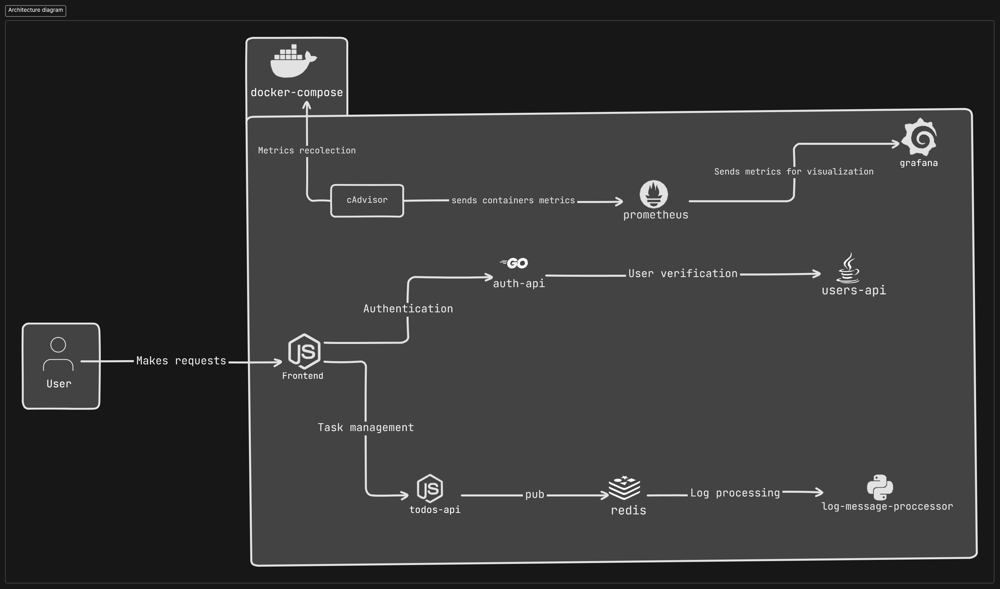
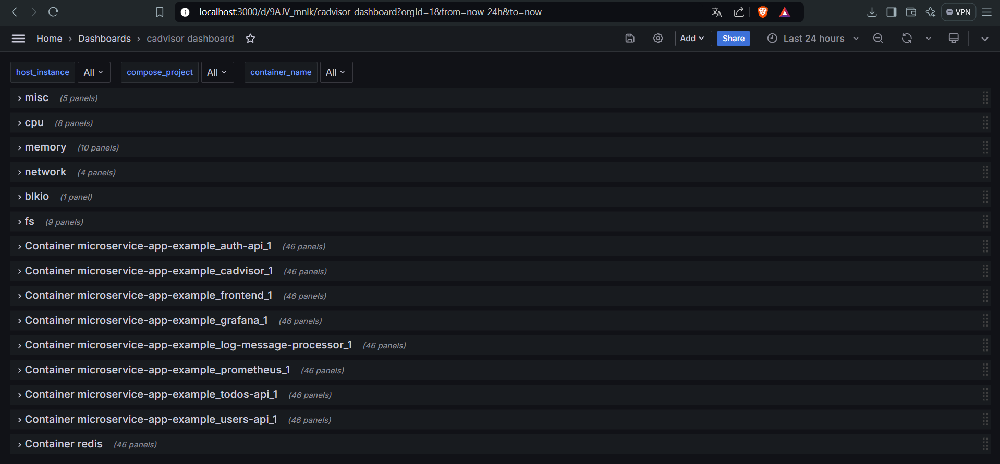
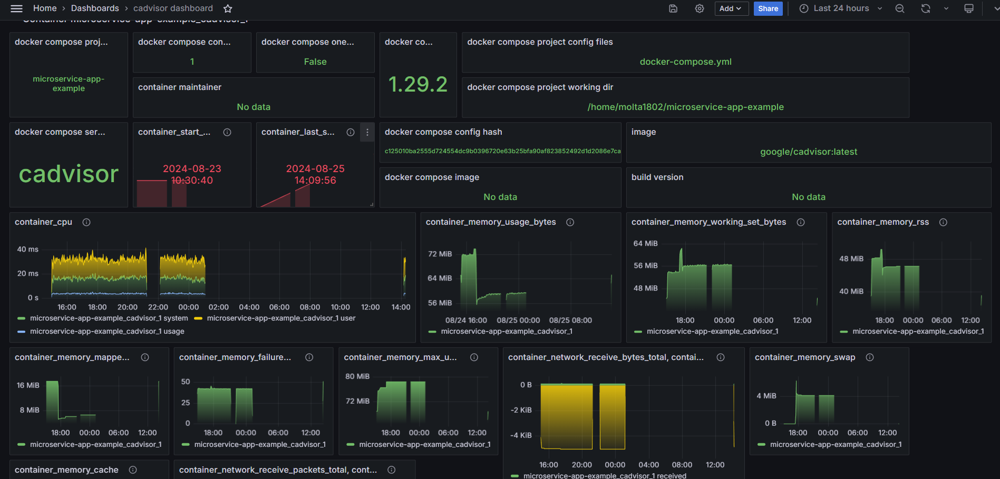
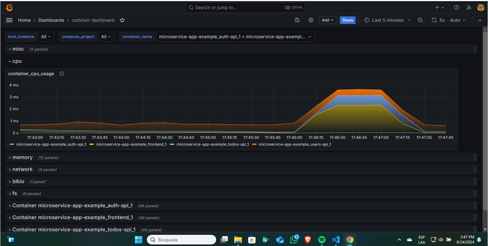
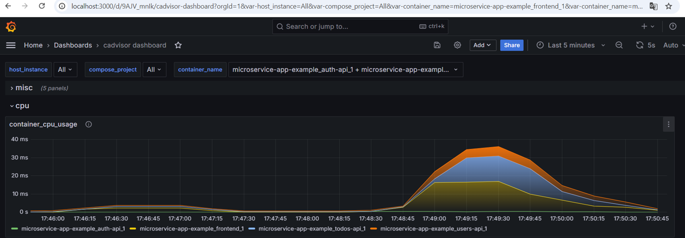
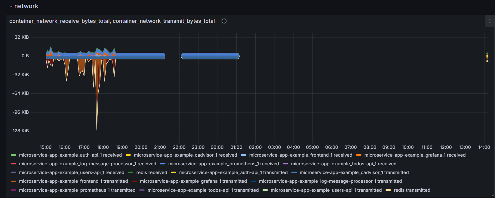
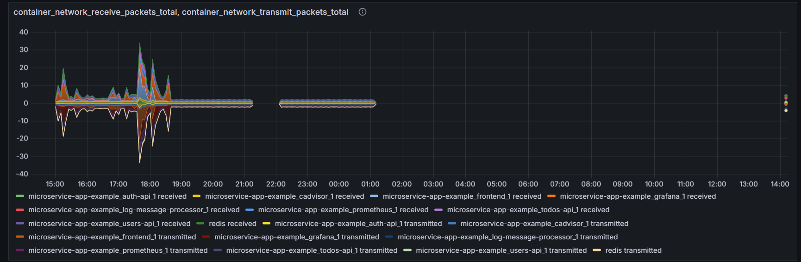

# 🚀 Project Description

This project is a microservices-based application composed of several independent services, each handling a specific part of the application's functionality. The main goal was to containerize these microservices using Docker and orchestrate their execution using Docker Compose. Additionally, the project includes a robust monitoring system leveraging Prometheus, cAdvisor, and Grafana.

## 🛠️ Technologies Used

- 🐳 **Docker**: To containerize each of the microservices.
- ⚙️ **Docker Compose**: To orchestrate and manage the execution of the different microservices.
- ⚙️ **Golang**: For the development of the Auth API.
- 🌐 **Node.js**: For the development of the Frontend and the TODOs API.
- 🐍 **Python**: For the development of the Log Message Processor.
- ☕ **Java (Spring Boot)**: For the development of the Users API.
- 📦 **Redis**: Used as middleware for communication between some services.
- 📈 **Prometheus**: For monitoring and collecting metrics from the application.
- 🖥️ **cAdvisor**: For collecting container resource usage and performance data.
- 📊 **Grafana**: For visualizing the metrics collected by Prometheus.

## 📋 Containerization and Execution Process

1. **🔄 Repository Cloning**

   First, the `microservice-app-example` repository was cloned from GitHub, which contained the source code for all the microservices.

   ```bash
   git clone https://github.com/bortizf/microservice-app-example.git
   ```

   _Note_ : The initial approach was to install all dependencies on a Windows machine, but it proved inefficient. Docker provided a more scalable solution, enabling the project to be run across different environments with ease.

## 📦 Creation of Dockerfiles for Each Microservice

2. Each microservice had its own Dockerfile, defining how to build the Docker image for each:

- **Auth API**: Built with Golang, using a base Golang image for compilation and a distroless image for execution.
- **Users API**: Built with Java (Spring Boot), using an OpenJDK image for building and running the application.
- **Log Message Processor**: Written in Python and processes messages using Redis, with a base Python image.
- **TODOs API and Frontend**: Both developed in Node.js, using a Node.js image for dependency management and execution.

## 🔨 Construction and Execution of Containers

3. Docker Compose was used to manage the build and execution of all microservices. The `docker-compose.yml` file in the root folder defines these services, along with the monitoring setup.

## 📈 Monitoring Setup

4. Monitoring was integrated using **Prometheus**, **cAdvisor**, and **Grafana**:

- **cAdvisor**: Collects container resource usage and performance metrics.
- **Prometheus**: Scrapes metrics from cAdvisor and other services, storing the data.
- **Grafana**: Provides a dashboard to visualize the metrics collected by Prometheus.

These services are also containerized and managed within Docker Compose.

## 🚀 Project Execution

5. To run all the microservices along with the monitoring stack, simply use the following command:

```bash
docker-compose up --build
```

This command builds Docker images for each service, starts them, and connects them to the same Docker network (`app-network`), allowing them to communicate with each other.

## 🌐 Summary of Services and Ports

- **Auth API**: Running on [http://localhost:8000](http://localhost:8000)
  
- **Users API**: Running on [http://localhost:8083](http://localhost:8083)
  
- **TODOs API**: Running on [http://localhost:8082](http://localhost:8082)
  
- **Frontend**: Running on [http://localhost:8080](http://localhost:8080)
  
- **Redis**: Listening on port `6379`
  
- **Prometheus**: Running on [http://localhost:9090](http://localhost:9090)
  
- **Grafana**: Running on [http://localhost:3000](http://localhost:3000)
  
- **cAdvisor**: Running on [http://localhost:8081](http://localhost:8081)

## Project testing 
For the automatic testing of the web page I used Python, in particular a library called Selenium, which allowed me to simulate the entry to the web pages, the login, the registration of activities and their respective deletion to see how the Grafana statistics changed.

## 📚 Conclusion

The project involved containerizing and deploying an application composed of multiple microservices, along with implementing a robust monitoring system. By using Docker and Docker Compose, the application can be run efficiently and consistently across different environments. Additionally, the integration of Prometheus, cAdvisor, and Grafana ensures that the application's performance and resource usage are monitored and visualized effectively, enhancing operational transparency and reliability.


# 🏗️ Architecture Diagram



# 📊 Grafana

Grafana is a powerful tool for data visualization and system monitoring. In this specific case, I used a pre-existing dashboard that provided all the necessary information. You can find more details here: [Grafana Dashboard](https://grafana.com/grafana/dashboards/19792-cadvisor-dashboard/).



This dashboard allows you to view all the running services and their statistics. In the example shown, it displays information from cAdvisor.



# 🧪 Test Proof

Below are images that demonstrate the automated tests performed. The first image shows the amount of CPU used by the containers when opening and closing the page.



The second image shows the amount of CPU used by the containers when opening the page, running the test script, and then closing all page instances.



# 🌐 Network Example

Grafana also allows us to view the number of packets sent and received, as well as the bytes transferred. Below is an example.

Bytes sent and received per container:



Packets sent and received by container:




